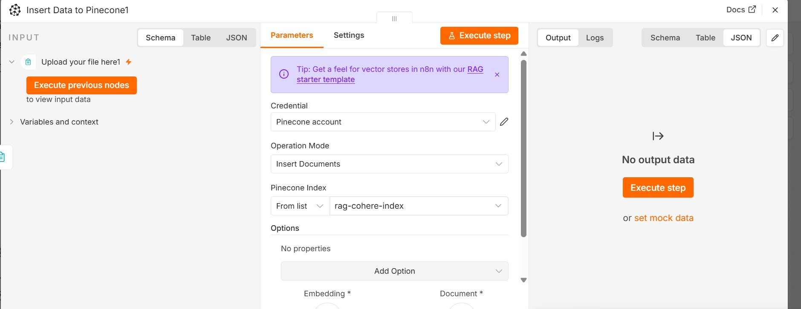
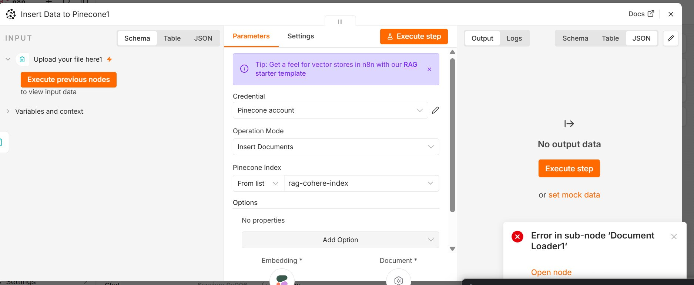
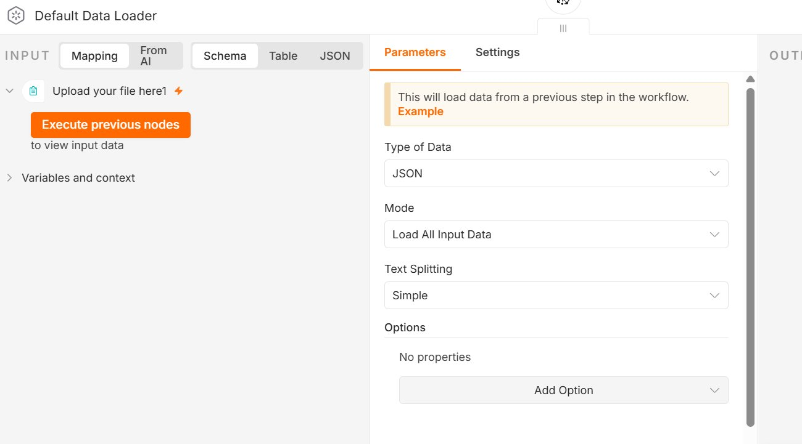
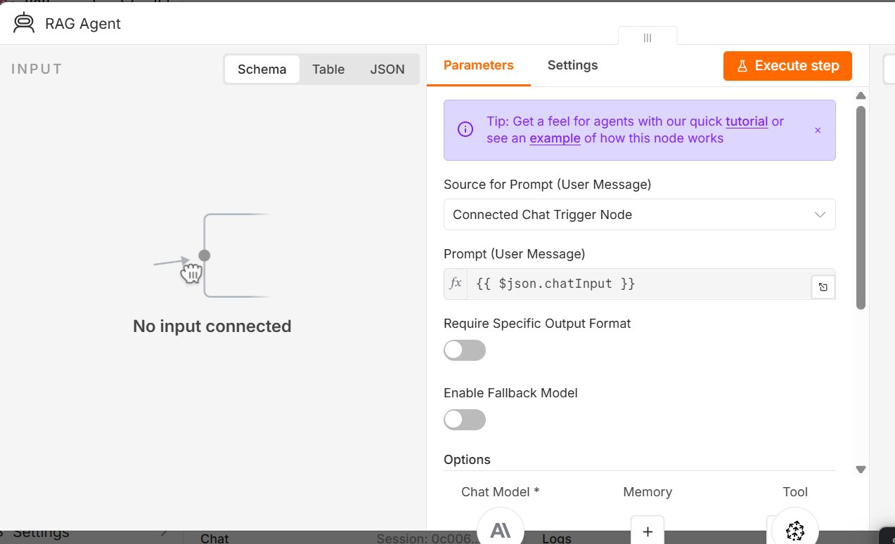
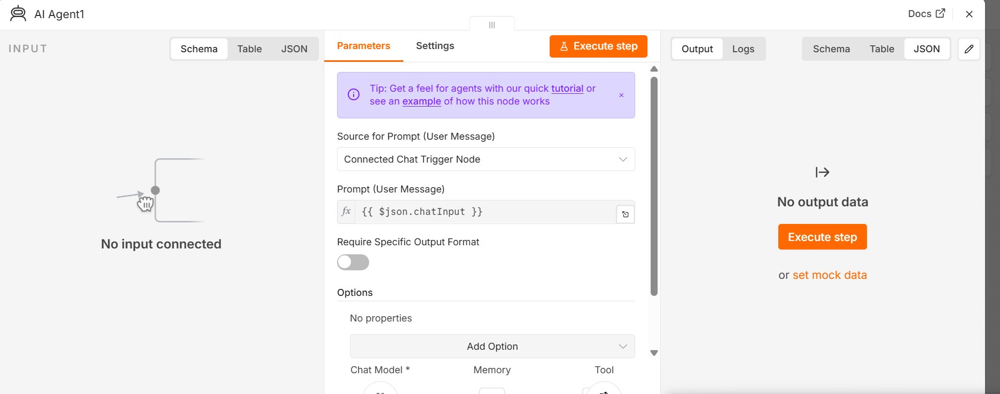
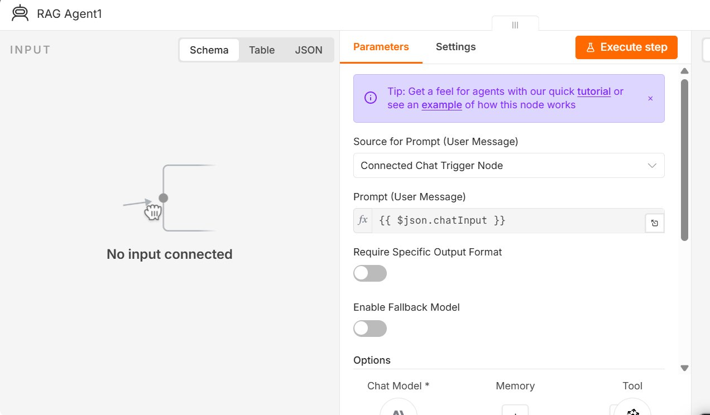
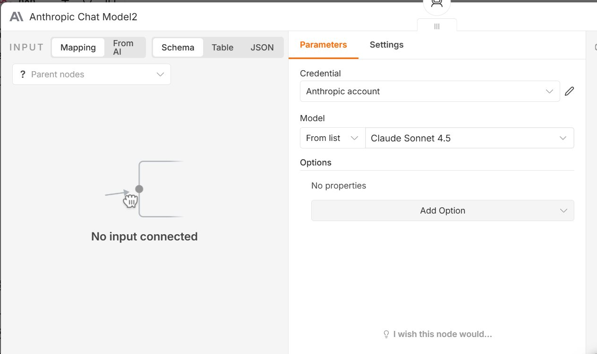
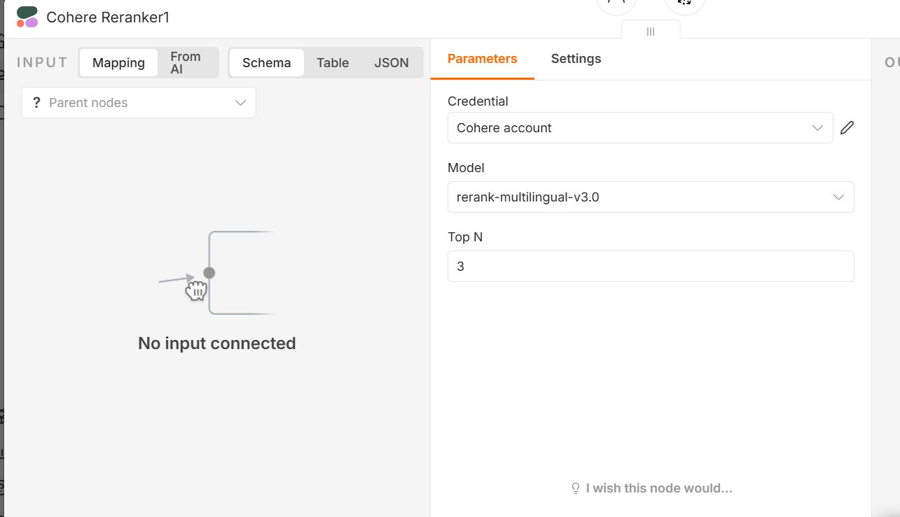
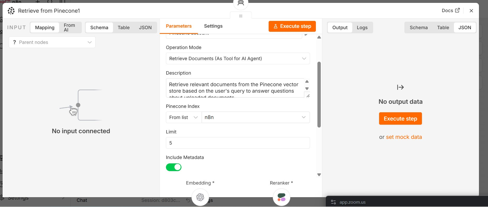

# lab_summary.md

## Summary

The most useful nodes in this RAG workflow are the **Pinecone Vector Store**, **Default Data Loader**, **RAG Agent**, and **Cohere Reranker** — together they form a complete document ingestion and retrieval pipeline. When picking a node, the key question is: *what does this node do to the data?* Trigger nodes start flows, loader nodes prepare raw documents, embedding nodes convert text to vectors, vector store nodes persist or retrieve them, and agent/LLM nodes reason over the results to generate answers. My top debugging tip: always check the **Input/Output panel** in n8n's execution view — mismatched data shapes (e.g. flat JSON when a LangChain Document array is expected) account for most errors, and seeing the actual JSON immediately shows where the chain breaks. In this workflow specifically, `Insert Data to Pinecone` writes to index `rag-cohere-index` while `Retrieve from Pinecone` reads from index `n8n` — in production these **must point to the same index**.

---

## Workflow: Document Upload RAG Chatbot with Cohere Reranking

### Pipeline Overview

```
INGESTION:
[File Upload Trigger] → [Default Data Loader] → [Insert Data to Pinecone]
                                                       ▲            ▲
                                            [OpenAI Embeddings]  [Text Splitter]

RETRIEVAL:
[Chat Trigger] → [RAG Agent] ← [Anthropic Chat Model2 / Claude Sonnet 4.5]
                     ▲
          [Retrieve from Pinecone1] ← [Cohere Reranker1]
                     ▲
          [OpenAI Query Embeddings]
```

---

## Node Reference Table

| # | Node Name | Type | Operation | Key Parameters | Role |
|---|-----------|------|-----------|----------------|------|
| 1 | Insert Data to Pinecone | Vector Store | Insert Documents | Index: rag-cohere-index | Stores embedded chunks in Pinecone |
| 2 | Default Data Loader | Document Loader | Load All Input Data | Type: JSON, Splitting: Simple | Converts input data to LangChain Documents |
| 3 | RAG Agent | AI Agent | ReAct Agent | Prompt: `{{ $json.chatInput }}`, Source: Chat Trigger | Orchestrates retrieval + answer generation |
| 4 | AI Agent1 / RAG Agent1 | AI Agent | ReAct Agent | Prompt: `{{ $json.chatInput }}`, Source: Chat Trigger | Secondary agent node (alternative/test version) |
| 5 | Anthropic Chat Model2 | LLM | Chat Completion | Model: Claude Sonnet 4.5 | Generates answers for RAG Agent |
| 6 | Cohere Reranker1 | Reranker | Rerank | Model: rerank-multilingual-v3.0, Top N: 3 | Reranks top 5 Pinecone results to top 3 |
| 7 | Retrieve from Pinecone1 | Vector Store | Retrieve as Tool | Index: n8n, Limit: 5, Include Metadata: ON | Retrieves relevant chunks on agent request |

---

## Detailed Node Analysis

---

### Node 1: Insert Data to Pinecone

**Type:** `@n8n/n8n-nodes-langchain.vectorStorePinecone`
**Role:** Receives embedded document chunks and upserts them into Pinecone during ingestion.

#### Screenshot — Node Configuration





> The error `Error in sub-node 'Document Loader1'` in Image 1 is upstream — it means the Document Loader sub-node failed to parse the file (likely the `pdf-parse` issue), not a Pinecone configuration problem.

#### Parameters

| Parameter | Value |
|-----------|-------|
| Credential | Pinecone account |
| Operation Mode | Insert Documents |
| Pinecone Index | rag-cohere-index |
| Options | No additional properties |
| Required sub-nodes | Embedding *, Document * |

#### Example Input JSON
```json
[
  {
    "pageContent": "AI is transforming industries worldwide. Machine learning models are deployed in healthcare and finance.",
    "metadata": {
      "source": "report.pdf",
      "chunk": 0
    }
  }
]
```

#### Example Output JSON
```json
{
  "upsertedCount": 1,
  "ids": ["rag-cohere-index-chunk-0"]
}
```

#### Transformation
LangChain Document objects + embedding vectors from sub-node → Pinecone upsert operation. Each record stored in Pinecone contains: a unique auto-generated ID, the float vector produced by the Embeddings sub-node, and the original `pageContent` + `metadata` as payload. Both `Embedding *` and `Document *` sub-node slots visible at the bottom of the panel are required — the node will error without them.

---

### Node 2: Default Data Loader

**Type:** `@n8n/n8n-nodes-langchain.documentDefaultDataLoader`
**Role:** Reads data from the previous workflow step and converts it into LangChain Document format for the vector store pipeline.

#### Screenshot — Node Configuration



#### Parameters

| Parameter | Value |
|-----------|-------|
| Type of Data | JSON |
| Mode | Load All Input Data |
| Text Splitting | Simple |
| Options | No additional properties |

#### Example Input JSON
```json
{
  "fileName": "company_report.pdf",
  "data": "<binary or extracted text content>",
  "mimeType": "application/pdf"
}
```

#### Example Output JSON
```json
[
  {
    "pageContent": "Full extracted text content from the uploaded file...",
    "metadata": {
      "source": "company_report.pdf",
      "loc": { "lines": { "from": 1, "to": 45 } }
    }
  }
]
```

#### Transformation
Raw input data (JSON or binary) from a previous node → array of LangChain Document objects with `pageContent` and `metadata` fields. `Load All Input Data` processes every input item without filtering. `Text Splitting: Simple` applies basic line-break splitting before passing to any connected Text Splitter sub-node. This node bridges n8n's native JSON data format and LangChain's Document format required by all vector store nodes.

---

### Node 3: RAG Agent (Main)

**Type:** `@n8n/n8n-nodes-langchain.agent`
**Role:** The orchestrator of the retrieval pipeline. Receives user chat messages, calls the Pinecone retrieval tool when needed, and generates grounded answers via Claude.

#### Screenshot — Node Configuration




#### Parameters

| Parameter | Value |
|-----------|-------|
| Source for Prompt (User Message) | Connected Chat Trigger Node |
| Prompt (User Message) | `{{ $json.chatInput }}` |
| Require Specific Output Format | OFF |
| Enable Fallback Model | OFF |
| Sub-node slots visible | Chat Model * (Anthropic icon), Memory (+), Tool (gear icon) |

#### Example Input JSON
```json
{
  "chatInput": "What does the document say about quarterly revenue?",
  "sessionId": "session_abc123",
  "action": "sendMessage"
}
```

#### Example Output JSON
```json
{
  "output": "According to the uploaded document, quarterly revenue grew by 12% in Q3 2024, driven primarily by EMEA expansion (source: company_report.pdf).",
  "sessionId": "session_abc123"
}
```

#### Transformation
User query string → ReAct agent loop → grounded answer. The agent: (1) reads `{{ $json.chatInput }}` from the Chat Trigger output, (2) reasons about what information it needs, (3) calls `Retrieve from Pinecone1` as a tool, (4) receives the top 3 reranked chunks back, (5) passes query + chunks + system prompt to Claude Sonnet 4.5, (6) returns the final answer. The `Source: Connected Chat Trigger Node` setting means the agent automatically maintains conversation session context across multiple turns.

---

### Node 4: AI Agent1 / RAG Agent1

**Type:** `@n8n/n8n-nodes-langchain.agent`
**Role:** A second AI Agent node — appears to be an alternative or experimental version of the RAG Agent, potentially with different sub-nodes connected.

#### Screenshot — Node Configuration





#### Parameters

| Parameter | Value |
|-----------|-------|
| Source for Prompt (User Message) | Connected Chat Trigger Node |
| Prompt (User Message) | `{{ $json.chatInput }}` |
| Require Specific Output Format | OFF |
| Enable Fallback Model | OFF |
| Sub-node slots | Chat Model *, Memory, Tool |

#### Example Input JSON
```json
{
  "chatInput": "Summarize the key findings from the uploaded report.",
  "sessionId": "session_xyz789"
}
```

#### Example Output JSON
```json
{
  "output": "The key findings are: 1) Revenue up 12% YoY, 2) New markets in SEA, 3) R&D investment increased 8%.",
  "sessionId": "session_xyz789"
}
```

#### Transformation
Identical pattern to Node 3. Both agent nodes share the same parameter structure — `{{ $json.chatInput }}` extracts the user message from the Chat Trigger JSON output. The distinction likely lies in which specific Chat Model and Tool sub-nodes are wired to each agent (visible as icons at the bottom of the panel), allowing testing of different LLM or retrieval configurations side-by-side in the same workflow.

---

### Node 5: Anthropic Chat Model2

**Type:** `@n8n/n8n-nodes-langchain.lmChatAnthropic`
**Role:** Provides the LLM reasoning layer for the RAG Agent. Generates the final natural language answer from retrieved context.

#### Screenshot — Node Configuration



#### Parameters

| Parameter | Value |
|-----------|-------|
| Credential | Anthropic account |
| Model | Claude Sonnet 4.5 (from list) |
| Options | No additional properties |

#### Example Input JSON
```json
{
  "messages": [
    {
      "role": "system",
      "content": "You are a helpful assistant. Answer based ONLY on the retrieved document context. Cite your sources."
    },
    {
      "role": "user",
      "content": "What does the document say about quarterly revenue?"
    },
    {
      "role": "tool",
      "content": "Retrieved chunks:\n[1] Q3 revenue grew 12% YoY...\n[2] EMEA region drove growth...\n[3] New markets contributed 4%..."
    }
  ]
}
```

#### Example Output JSON
```json
{
  "content": "According to the uploaded document, quarterly revenue grew by 12% in Q3, driven primarily by EMEA expansion and new market entry.",
  "role": "assistant",
  "model": "claude-sonnet-4-5",
  "usage": {
    "input_tokens": 380,
    "output_tokens": 54
  }
}
```

#### Transformation
Structured message array (system prompt + user question + retrieved context) → Claude-generated text response. The model only receives the 3 reranked chunks from Cohere — not the full document — which keeps responses within token limits and reduces hallucination. Connected to the RAG Agent as `ai_languageModel` sub-node; the agent assembles the full message array and passes it here for completion.

---

### Node 6: Cohere Reranker1

**Type:** `@n8n/n8n-nodes-langchain.rerankerCohere`
**Role:** Re-scores the 5 candidate chunks from Pinecone using a cross-encoder model for higher precision, returning only the top 3.

#### Screenshot — Node Configuration



#### Parameters

| Parameter | Value |
|-----------|-------|
| Credential | Cohere account |
| Model | rerank-multilingual-v3.0 |
| Top N | 3 |

#### Example Input JSON
```json
{
  "query": "What does the document say about quarterly revenue?",
  "documents": [
    { "pageContent": "Q3 revenue grew 12% year-over-year...", "score": 0.87 },
    { "pageContent": "Company expanded into 3 new SEA markets...", "score": 0.84 },
    { "pageContent": "EMEA region drove most of the revenue increase...", "score": 0.81 },
    { "pageContent": "R&D investment increased by 8% this quarter...", "score": 0.76 },
    { "pageContent": "Employee headcount grew from 450 to 520...", "score": 0.71 }
  ]
}
```

#### Example Output JSON
```json
[
  { "pageContent": "Q3 revenue grew 12% year-over-year...", "relevanceScore": 0.97, "index": 0 },
  { "pageContent": "EMEA region drove most of the revenue increase...", "relevanceScore": 0.94, "index": 2 },
  { "pageContent": "Company expanded into 3 new SEA markets...", "relevanceScore": 0.71, "index": 1 }
]
```

#### Transformation
Pinecone bi-encoder scores (fast, approximate) → Cohere cross-encoder relevance scores (slower, precise). The cross-encoder reads both the **query** and each **document** together in a single pass, giving far richer relevance signal than comparing embedding vectors alone. `Top N: 3` filters the 5 Pinecone candidates down to 3 before passing to the RAG Agent, reducing noise. `rerank-multilingual-v3.0` handles documents in multiple languages — useful for multilingual document collections.

---

### Node 7: Retrieve from Pinecone1

**Type:** `@n8n/n8n-nodes-langchain.vectorStorePinecone`
**Role:** Queries the Pinecone vector index for the 5 chunks most similar to the user query, then sends them through the Cohere Reranker before returning to the RAG Agent.

#### Screenshot — Node Configuration



#### Parameters

| Parameter | Value |
|-----------|-------|
| Credential | Pinecone account |
| Operation Mode | Retrieve Documents (As Tool for AI Agent) |
| Description | Retrieve relevant documents from the Pinecone vector store based on the user's query to answer questions about uploaded documents |
| Pinecone Index | n8n |
| Limit | 5 |
| Include Metadata | ON (green toggle) |
| Sub-nodes | Embedding *, Reranker * |

#### Example Input JSON
```json
{
  "query": "What does the document say about quarterly revenue?",
  "embedding": [0.0231, -0.1142, 0.0875, "... 509 more floats ..."]
}
```

#### Example Output JSON
```json
[
  {
    "pageContent": "Q3 revenue grew 12% year-over-year, driven by EMEA expansion...",
    "metadata": { "source": "company_report.pdf", "chunk": 3 },
    "relevanceScore": 0.97
  },
  {
    "pageContent": "EMEA region contributed 45% of total quarterly revenue...",
    "metadata": { "source": "company_report.pdf", "chunk": 4 },
    "relevanceScore": 0.94
  },
  {
    "pageContent": "New SEA markets added 4% revenue contribution in Q3...",
    "metadata": { "source": "company_report.pdf", "chunk": 7 },
    "relevanceScore": 0.71
  }
]
```

#### Transformation
Query vector → Pinecone ANN (approximate nearest-neighbour) search → top 5 chunks by cosine similarity → Cohere cross-encoder reranking → top 3 chunks returned to RAG Agent as tool result. The mode `Retrieve Documents (As Tool for AI Agent)` is critical: it registers this node as a callable tool so the RAG Agent invokes it on demand rather than it running automatically. `Include Metadata: ON` ensures `source` filename and chunk index are included in results, allowing the agent to cite specific documents in its answers.

> ⚠️ **Index mismatch:** This node queries index `n8n`, but `Insert Data to Pinecone` writes to `rag-cohere-index`. Both must use the same index name for the system to retrieve what was actually ingested.

---

## Key Observations Across All Nodes

| Observation | Detail |
|-------------|--------|
| **Two separate pipelines** | Ingestion (upload → store) and Retrieval (chat → answer) are independent pipelines connected only through the Pinecone index |
| **Sub-node pattern** | LangChain nodes use modular sub-nodes — swap Claude for GPT by changing only the Chat Model sub-node, no other changes needed |
| **Tool mode matters** | `Retrieve as Tool for AI Agent` gives the agent autonomy to decide *when* to retrieve, vs. always retrieving in a fixed chain |
| **Two-stage retrieval** | Pinecone (fast, recall-focused, returns 5) → Cohere reranker (precise, returns top 3) — balances speed with accuracy |
| **n8n expression syntax** | `{{ $json.chatInput }}` accesses the `chatInput` field from the previous node's JSON output — this is how all data flows between nodes |
| **Index mismatch bug** | Insert uses `rag-cohere-index`, Retrieve uses `n8n` — must be the same index for end-to-end retrieval to work |
| **Multilingual reranker** | `rerank-multilingual-v3.0` supports non-English documents — relevant for European document sets |
